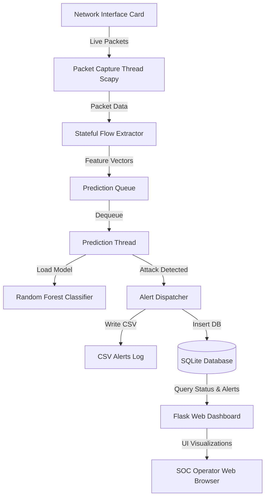

# Implementation Plan - AI-Powered Real-Time Network Intrusion Detection System (NIDS)

This plan outlines the design, architecture, and step-by-step implementation of a production-style, machine-learning-based Network Intrusion Detection System (NIDS) for Windows 11. It utilizes Scapy for packet capture, a stateful flow tracking system for real-time feature extraction, a Random Forest Classifier trained on key features of the CICIDS2017 dataset, a SQLite database for logging alerts, and a Flask dashboard for visualization and management.

---

## Architecture Overview

The system operates as a multi-threaded Python application composed of the following layers:



### Components and Threading Model

1. **Packet Capture Thread**: Uses Scapy to sniff raw packets from a selected network interface.
2. **Stateful Flow Extractor**: Tracks packet directions, lengths, protocols, port combinations, and TCP flags. It structures them into active "flows" and updates features.
3. **Prediction Thread**: Reads extracted flow records from a thread-safe Queue, passes them to the trained Random Forest model, makes predictions, and determines threat levels.
4. **Alert Dispatcher**: Writes alerts to the console, a CSV file, and insert rows into the SQLite database.
5. **Flask Dashboard Thread**: Serves a dynamic Web GUI to display real-time statistics (total packets, alert rates, attack types), render charts (Plotly / Chart.js), list alerts, and manage the system.

---

## Proposed Changes and Directory Structure

We will initialize the workspace (`d:\Random Forest IDS`) with the following structure:

```
d:\Random Forest IDS/
│
├── dataset/                    # Directory for raw/simulated datasets
│   └── simulate_dataset.py     # Script to generate a realistic CICIDS2017-like dataset for training/testing
├── models/                     # Saved ML models and scaler metadata
│   └── scaler.joblib           # Saved MinMaxScaler / StandardScaler (if needed)
│   └── model.joblib            # Trained Random Forest Model
│   └── label_encoder.joblib    # Label Encoder mapping indices to attack classes
├── logs/                       # Text and CSV log output
│   └── alerts.csv              # Backup CSV logs of detections
├── captures/                   # Directory to save PCAP files if needed
├── templates/                  # Flask HTML templates
│   └── index.html              # Main dashboard view
├── static/                     # Flask static assets
│   ├── css/
│   │   └── style.css           # Custom styling for Dark-Mode Glassmorphism Dashboard
│   └── js/
│       └── app.js              # SSE/WebSockets or AJAX polling script for live charts
│
├── config.py                   # Configuration parameters (ports, db name, interface, models)
├── database.py                 # SQLite database helper for CRUD operations
├── alerts.py                   # Alert handler (DB, Console, CSV)
├── preprocess.py               # Preprocessing functions (cleaning, encoding, splitting)
├── train_model.py              # Script to train RF model on real or simulated CICIDS2017
├── feature_extraction.py       # Stateful Flow class mapping packets to ML features
├── packet_capture.py           # Scapy sniffer module running in a thread
├── predict.py                  # Predictor pulling flows from the queue and calling the model
├── app.py                      # Orchestrator and Flask Server starting all threads
├── utils.py                    # Helper utilities (list interfaces, network helpers)
└── requirements.txt            # Python packages
```

---

## Detailed Component Specifications

### 1. Configuration (`config.py`)
Stores directory paths, model hyperparameters, network capture settings, database configurations, and feature lists.
- Dynamically finds default paths.
- Holds selected features list to ensure training and real-time capture use the exact same feature order.

### 2. Preprocessing & Training Pipeline (`preprocess.py` & `train_model.py`)
Processes CICIDS2017 CSV files or a generated mock dataset.
- Cleans data: Handles NaN/Infinite values, strips spaces from column names.
- Encodes labels: Maps attack classes (e.g., `BENIGN`, `DDoS`, `PortScan`, `Bot`) to integers.
- Performs train-test split, scales features (if necessary, though RF is scale-invariant), and fits a `RandomForestClassifier`.
- Saves the trained model, encoder, and scaler using `joblib`.
- Prints evaluation metrics (Accuracy, Precision, Recall, F1, Confusion Matrix).

### 3. Stateful Feature Extraction (`feature_extraction.py`)
Maintains a sliding dictionary of network connections.
Key extracted features mapped to the CICIDS2017 feature spaces:
- `Destination Port`
- `Protocol`
- `Flow Duration` (time elapsed since flow start)
- `Total Fwd Packets` (packets matching source-to-destination)
- `Total Length of Fwd Packets`
- `Fwd Packet Length Max`, `Min`, `Mean`
- `Flow Bytes/s` and `Flow Packets/s`
- `SYN Flag Count`, `RST Flag Count`, `PSH Flag Count`, `ACK Flag Count` (count of flags in the flow)

### 4. Packet Capture Engine (`packet_capture.py`)
- Uses Scapy's `sniff()` function.
- Runs asynchronously in a thread.
- Filters and parses TCP, UDP, and ICMP packets, feeding them to the flow extractor.

### 5. Prediction Engine (`predict.py`)
- Reads active flows from the queue.
- Prepares the feature vector.
- Executes prediction using the loaded model.
- Determines threat level based on classification:
  - `BENIGN`: None
  - `PortScan`, `Brute-force`: `MEDIUM` or `HIGH`
  - `DDoS`, `Botnet`, `Malware`: `CRITICAL`
- Forwards matches to the Alert System.

### 6. Alerts and SQLite Database (`alerts.py` & `database.py`)
- Initializes SQLite table `alerts` with: `id`, `timestamp`, `src_ip`, `dst_ip`, `src_port`, `dst_port`, `protocol`, `attack_type`, `risk_level`, `packet_count`, `flow_duration`.
- Offers quick query functions for dashboard charts (e.g., attacks by type, risk level breakdown, alert count trends).

### 7. Flask Dashboard (`app.py`, `templates/index.html`, static assets)
- Renders a modern responsive dashboard using **Glassmorphism CSS** and dark themes.
- Leverages AJAX polling or Server-Sent Events (SSE) to update:
  - System status (Memory, CPU, Sniffing state).
  - High-level KPIs: Total Packets Captured, Detections, Active Flows.
  - Interactive charts (Plotly or Chart.js) depicting:
    - Attack Distribution (Pie/Donut chart).
    - Threats Over Time (Line chart).
    - Port Activity (Bar chart).
  - Live Alert Log (Datatable displaying recent alerts).

---

## User Review Required

> [!IMPORTANT]
> **Windows npcap Requirement**: Scapy requires **Npcap** to capture raw network traffic on Windows. Npcap must be installed in **WinPcap API-compatible mode** (which is a standard option during the installer).
> 
> **Admin Rights**: The application must be run in an **Administrator** command prompt (or VS Code launched as Admin) to allow Scapy to bind to the physical network card and capture raw sockets.
> 
> **CICIDS2017 Dataset Size**: The official CICIDS2017 dataset is ~3GB in size. To ensure immediate usability and debugging, we will provide a script (`dataset/simulate_dataset.py`) to generate a realistic CICIDS2017 format CSV. The trainer will automatically check if the real dataset is present, and if not, fallback to using/generating the simulated dataset so you can run the dashboard and test the system immediately.

---

## Verification Plan

### Automated/Unit Testing
1. **Mock Training**: Run `python train_model.py` with the simulated dataset to verify the pipeline, metrics logging, and model export (`models/model.joblib`).
2. **Feature Extraction Tests**: Read a sample PCAP file or feed controlled mock Scapy packets to `feature_extraction.py` and verify calculated features matches expected results.
3. **Database Operations**: Run a script to initialize database tables and insert/retrieve test alerts.

### Live Network Testing (VirtualBox Lab or Local)
1. **Dashboard Check**: Access `http://127.0.0.1:5000` to verify page rendering, styles, and responsive layout.
2. **Active Sniffing Test**: Select active adapter, initiate traffic (e.g., browse websites, ping localhost), and see the live packet count increase in the dashboard.
3. **Security Lab Attack Simulation**:
   - **ICMP Flood/Ping Scan**: Run `ping -t 127.0.0.1` or a ping sweep from Kali Linux.
   - **Port Scan**: Use `nmap -sS -F <Host_IP>` from Kali Linux to trigger "PortScan" classification.
   - **Brute-Force**: Run a basic Python script that performs rapid local TCP connection attempts on port 22/80 to simulate brute force.
   - Verify that these trigger alerts in the dashboard in real time with correct threat levels.
