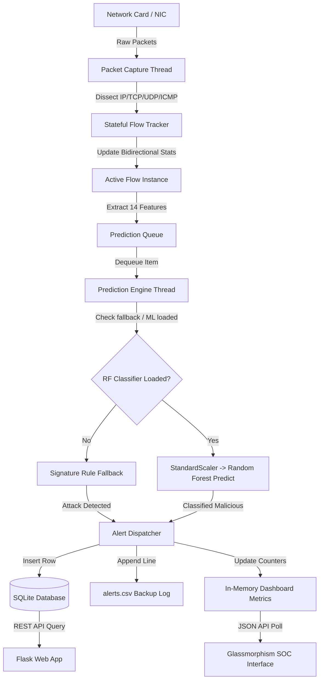

# Aegis NIDS Project Workflow & Machine Learning Deep Dive

This document provides a comprehensive operational analysis of the Aegis Network Intrusion Detection System (NIDS) and dissects the underlying Machine Learning (ML) architecture based on the Random Forest Classifier.

---

## 1. System Operational Workflow

The Aegis NIDS operates as a high-throughput, multi-threaded pipeline designed to capture live packets, reconstruct stateful bidirectional flows, extract 14 quantitative features, run classifier predictions, and dispatch database/visual alerts.



### Stage-by-Stage Breakdown

1. **Packet Capture (`packet_capture.py`)**:
   - Uses Scapy's `sniff()` function to hook network adapters.
   - Operates in a background daemon thread (`PacketCaptureEngine`).
   - Filters traffic at the kernel level using a BPF filter: `ip and (tcp or udp or icmp)`.
   - Records metadata (DNS queries, HTTP servers, content types) into the static `kibana_tracker` state.

2. **Stateful Flow Tracking (`feature_extraction.py`)**:
   - Packets are binned bidirectionally using a unique 5-tuple key: `(src_ip, dst_ip, src_port, dst_port, protocol)`.
   - Direction is determined by comparing the packet's source and destination against the flow's initial packet.
   - Aggregates packet count, payload lengths, flow duration, and TCP flag counts in real time.

3. **Prediction Queueing & Engine (`predict.py`)**:
   - Flow features are wrapped in a dictionary and pushed onto a thread-safe `queue.Queue()`.
   - The `PredictionEngine` thread continuously polls the queue.
   - For ICMP traffic, it bypasses the Random Forest model and applies a hardcoded ICMP Flood signature (alerting if packet count $\ge 30$).
   - For TCP/UDP, it processes the 14-feature vector through a `StandardScaler` and makes a classification using the `RandomForestClassifier`.

4. **Alert Dispatching & UI Update (`alerts.py`, `database.py`, `app.js`)**:
   - Detections trigger database insertions (`alerts` table) and console alerts, and append to `logs/alerts.csv`.
   - The Flask app (`app.py`) serves the API endpoints.
   - The frontend JavaScript (`app.js`) polls endpoints, animates KPI values, and updates Chart.js figures using gradients.

---

## 2. Machine Learning Architecture: The Random Forest Classifier

### Structural Difference: Why Random Forest Has No "Layers" or "Activation Functions"

Unlike Deep Neural Networks (DNNs), which pass tensors through stacked layered representations (Dense, Convolutional, Recurrent) using non-linear activation functions (e.g., ReLU, Sigmoid), a **Random Forest Classifier** is a tree-based ensemble algorithm. 

#### Structural Comparison Table

| Property | Deep Neural Networks (DNN) | Random Forest (RF) |
| :--- | :--- | :--- |
| **Basic Unit** | Artificial Neuron | Decision Tree |
| **Information Flow** | Forward propagation through continuous matrix multiplications | Traversal of logical binary decision nodes (True/False) |
| **Aesthetics** | Stacked hidden layers (deep representation) | Ensemble forest of parallel estimators (breadth representation) |
| **Activation Functions** | Non-linear thresholding (ReLU, GELU, Sigmoid) | None. Decisions are hard boundaries (e.g., $x_i > \text{threshold}$) |
| **Optimization** | Gradient Descent (Backpropagation) | Recursive partitioning based on impurity metrics (Gini, Entropy) |

### Core Concept: Ensemble Learning via Bagging

Random Forest uses a technique called **Bootstrap Aggregating (Bagging)** and **Feature Randomness**:
1. **Bootstrapping**: Each decision tree in the forest is trained on a random subset of the training data (sampled with replacement).
2. **Feature Randomness**: At each node split in a tree, only a random subset of the 14 features is considered. This decorrelates the trees, preventing a single highly dominant feature from making all trees identical.
3. **Voting**: For classification, every tree in the forest predicts a class label. The final output is determined by a majority vote among all trees.

---

## 3. Mathematical Operations of a Decision Tree

A single estimator (Decision Tree) is built from the root node down by recursively partitioning the feature space.

### 1. Split Criteria (Gini Impurity)
The default criterion used in Aegis NIDS is the **Gini Impurity**, which measures the probability of a randomly chosen element from the dataset being incorrectly labeled if it was randomly labeled according to the distribution of labels in the subset.

For a dataset with $C$ classes, the Gini Impurity $I_G(p)$ of a node is:

$$I_G(p) = 1 - \sum_{i=1}^{C} p_i^2$$

Where $p_i$ is the probability/fraction of items labeled with class $i$ at that node.
- A node with only one class (perfectly pure) has $I_G = 0$.
- A node with evenly split classes has the maximum Gini Impurity.

At each node, the decision tree searches for the feature $f$ and split threshold $t$ that yields the maximum **Information Gain (IG)** (decrease in impurity):

$$\Delta I_G = I_G(parent) - \left( \frac{N_{left}}{N_{parent}} I_G(left) + \frac{N_{right}}{N_{parent}} I_G(right) \right)$$

### 2. Decision Boundaries
Unlike neural networks which draw smooth curved classification boundaries, Random Forest draws orthogonal (axis-aligned) decision steps. For example:
- *If `Destination Port` $\le 22$ and `SYN Flag Count` $> 15$, split left (likely SSH/FTP brute force).*

---

## 4. Hyperparameters Specified in Aegis NIDS

The classifier is initialized with the following hyperparameters in `train_model.py`:

```python
rf_model = RandomForestClassifier(
    n_estimators=100,
    max_depth=18,
    random_state=42,
    class_weight="balanced",
    n_jobs=-1
)
```

1. **`n_estimators = 100`**:
   - The number of decision trees in the forest. 
   - *Why 100?* It provides an optimal balance between prediction variance reduction and computational overhead. Adding more trees does not cause overfitting, but increases memory usage.
2. **`max_depth = 18`**:
   - The maximum depth of each tree. Limiting the depth to 18 prevents trees from expanding until all leaves are pure, which reduces overfitting and speeds up inference on live capture flows.
3. **`random_state = 42`**:
   - Sets the seed for random number generation. This ensures that the bootstrapping of data and feature selection at nodes is reproducible across retraining sessions.
4. **`class_weight = "balanced"`**:
   - Automatically adjusts weights inversely proportional to class frequencies in the input data: $W_c = \frac{N}{C \times N_c}$.
   - Crucial for NIDS because benign traffic vastly outnumbers malicious attacks.
5. **`n_jobs = -1`**:
   - Tells scikit-learn to utilize all available CPU cores to build and evaluate the trees in parallel.

---

## 5. Feature Engineering and Preprocessing Pipeline

### 1. The 14 Flow Features Used
These features are extracted by `feature_extraction.py` and are aligned with the CICIDS2017 dataset standard:

1. **Destination Port**: Identifies target service (e.g. 80 for HTTP, 22 for SSH).
2. **Protocol**: Protocol number (6 for TCP, 17 for UDP).
3. **Flow Duration**: Time elapsed between first and last packets.
4. **Total Fwd Packets**: Packets sent from source to destination.
5. **Total Length of Fwd Packets**: Total bytes sent in the forward direction.
6. **Fwd Packet Length Max**: Maximum payload size in forward packets.
7. **Fwd Packet Length Min**: Minimum payload size in forward packets.
8. **Fwd Packet Length Mean**: Average payload size in forward packets.
9. **Flow Bytes/s**: Throughput rate (total bytes / duration).
10. **Flow Packets/s**: Packet rate (total packets / duration).
11. **SYN Flag Count**: Total packets with TCP SYN flag set.
12. **RST Flag Count**: Total packets with TCP RST flag set.
13. **PSH Flag Count**: Total packets with TCP PSH flag set.
14. **ACK Flag Count**: Total packets with TCP ACK flag set.

### 2. Preprocessors Used
* **`StandardScaler`**: 
  - Standardizes features by removing the mean and scaling to unit variance: $z = \frac{x - \mu}{\sigma}$.
  - Although Decision Trees are scale-invariant, the `StandardScaler` is applied here to normalize rates and packet lengths, ensuring that data is aligned if alternative models (like SVM or Neural Networks) are introduced.
* **`LabelEncoder`**: 
  - Converts string labels (`BENIGN`, `DDoS`, `PortScan`, etc.) to integer indices ($0$ to $7$) for training, and performs the inverse transformation during prediction.
